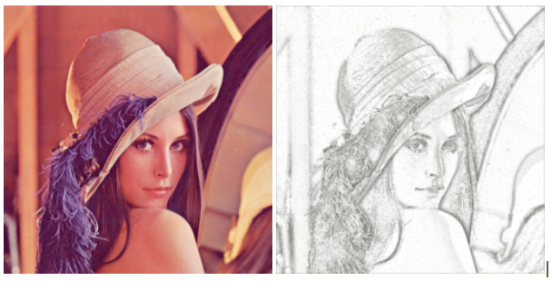

# Image 2 Sketch

📓 [Explanation Notebook with Code](notebook/novel-method-explanation.ipynb) |
⭐ [Results]()

## 📖 Overview
1. [Introduction]()
1. [Current Method]()
1. [My Method (Novel Idea)]()
1. [A Few Results]()
1. [Running it On Your Machine]()
1. [Bibliography]()

## Introduction

## Current Method

## Novel Method

## A Few Results

## Running it On Your Machine

## Bibliography
1. [How to create a beautiful pencil sketch effect with OpenCV and Python ~Ask A Swiss](https://www.askaswiss.com/2016/01/how-to-create-pencil-sketch-opencv-python.html)
1. [Open CV](https://opencv.org/)
1. [Python 3](https://www.python.org/)
1. [Git](https://git-scm.com/)
1. [Graph Theory and Its Applications to Image Segmentation ~IEEE](https://ieeexplore.ieee.org/document/8389737)
