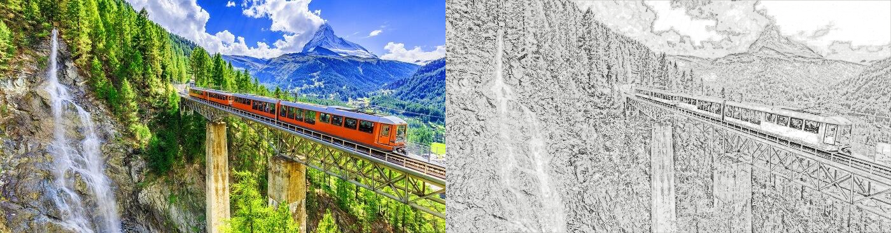

# Image 2 Sketch

📄 [Project Report](assets/image-2-sketch-report.pdf) |
📓 [Explanation Notebook with Code](notebook/novel-method-explanation.ipynb) |
⭐ [Results](#a-few-results)


## 📖 Overview
1. [Introduction](#introduction)
1. [Current Method](#current-method)
1. [My Method (Novel Idea)](#novel-method)
1. [A Few Results](#a-few-results)
1. [Running it On Your Machine](#running-it-on-your-machine)
1. [Bibliography](#bibliography)

## Introduction
There are several methods to extract edges from images. There are also several other 
methods for object detection and region segmentation. In this project I propose a novel
method for Feature extraction from Images and use this method to create sketch composite
for the given Image.

## Current Method
The current State of the art method is the Gaussian Blur-Blend Method which has 
the following algorithm:

```python
def gaussian_blend_blur(I: image, k: Kernel Size):
    J = grayscale_of_image(I)
    K = gaussian_kernel_of_size(k, k)
    B = gaussian_blur_of_image_with_kernel(J, K)
    result = J / B
    return result
```

## Novel Method
We introduce a new method for feature extraction, the Orthogonal Gaussian Lattice Method
which takes 3 Gaussian and computes teh inverse of the grayscale of the image with 
these 3 Gaussian and then uses a connectivity bound parameter alpha to create 3 Simple
Graphs from these inverse gaussian. These graphs are then used to extract Lattices from
the image and these lattices are then used as features and for image sketching.

The algorithm is as follows and for full details please reefr to the
[Jupyter Notebook with Complete Explanation](notebook/novel-method-explanation.ipynb).


## A Few Results


 


## Running it On Your Machine
The program requires the following dependencies:
1. [Python 3](https://www.python.org/)
1. [pip](https://pip.pypa.io/en/stable/)
1. [Git](https://git-scm.com/)

Clone and install all dependencies:
```shell script
git clone https://github.com/anishLearnsToCode/image2sketch.git
cd image2sketch
mkdir results
mkdir data
pip install -r requirements.txt
```

To test this program on some sample images see `src/test.py`. Create a directory 
`/data` under the project root and add some sample images there for testing purposes. 
Preferably add PNG Images as they store full data without compression. Inside 
`src/test.py` set the path to yor image and you can also further change Hyper-parameters
from the file `src/control_parameters.py` and run it as

```shell script
cd src
python test.py 
```

Results will be displayed and also saved under the directory `results/{image_name}` 
where `image_name` comes from `src/test.py`.


## Bibliography
1. [How to create a beautiful pencil sketch effect with OpenCV and Python ~Ask A Swiss](https://www.askaswiss.com/2016/01/how-to-create-pencil-sketch-opencv-python.html)
1. [Open CV](https://opencv.org/)
1. [Python 3](https://www.python.org/)
1. [Git](https://git-scm.com/)
1. [Graph Theory and Its Applications to Image Segmentation ~IEEE](https://ieeexplore.ieee.org/document/8389737)
1. [Image Sketch Online](https://pencilsketch.imageonline.co/index.php)
1. [Photofunia Sketch Effect](https://photofunia.com/effects/sketch)
1. [convertimage.net](https://convertimage.net/online-photo-effects/online-photo-drawing-sketch.asp?i=20201111-110144-urqmr)
1. [Convert Image to GrayScale ~KD Nuggets](https://www.kdnuggets.com/2019/12/convert-rgb-image-grayscale.html#:~:text=An%20intuitive%20way%20to%20convert,into%20a%20reasonable%20gray%20approximation.)
1. [pip](https://pip.pypa.io/en/stable/)
